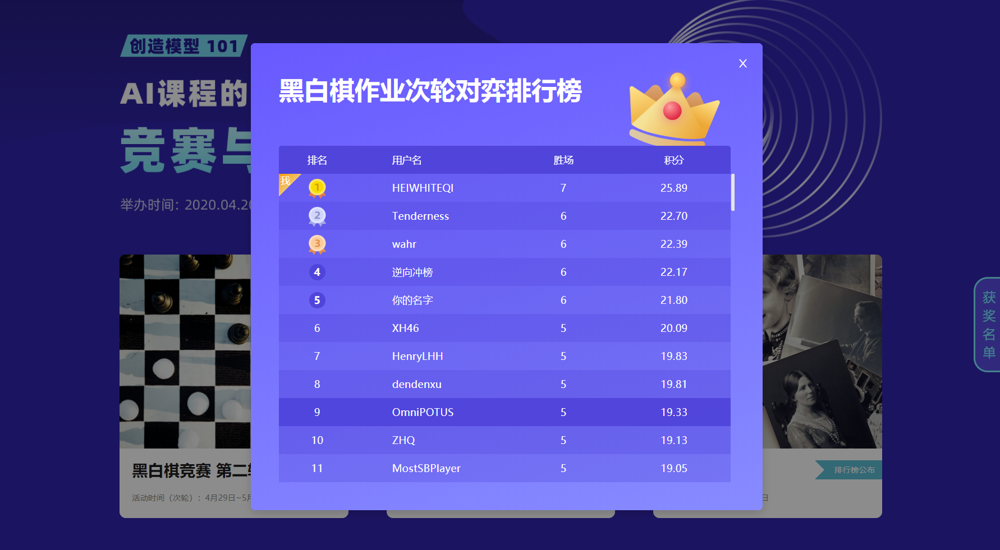

# AI Reversi

This project is only for Zhejiang University AI Course.

**This project works well on mo.zju.edu.cn and actually takes first place over many advanced algorithms on a computer with restricted computing power.**

### Basic Methods

- Minimax search with limited depth
- Believe the final result will be reversed even if our model is at disadvantage in the middle of a game
- Differential test with a slightly stronger RL model to fix some flaws in heuristic function until our model defeat it

### Test Results

64 in total, winning from 40 - 24 to 64 - 0. Detailed pictures are in doc.

### Contest Results

First place. The only one winning all matches.

